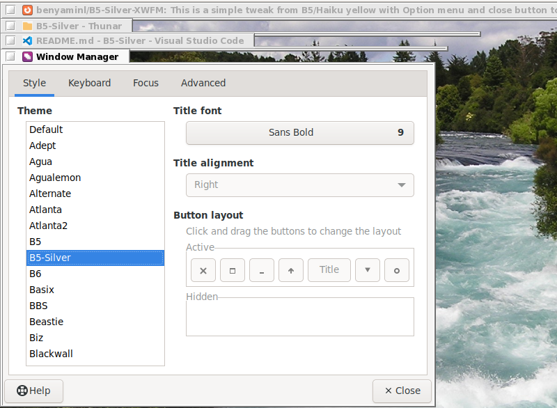

# B5 Silver XFWM4 

A simple tweak from B5 / BeOS 5 theme, from Yellow to silver... to match new Adaiwata Light theme

It inclide app Icon on window option menu. 

Tested with XFWM 4.18 on Fedora 38 Xfce spin

## How to Install 
```
mkdir -p ~/.local/share/themes/B5-Silver
cd ~/.local/share/themes/B5-Silver
git clone https://github.com/benyaminl/B5-Silver-XWFM.git
```

## Screenshoot View 
This is the view of the window manager
